# Engineering Thesis: "Synthetic data generation for object detection systems using Unreal Engine 5"
Poznan University of Technology, 2023
 

The main purpose of this project was to create synthetic data generator using game engine Unreal Engine 5.

The following features were implemented:

:heavy_check_mark: - Virtual city in Unreal Engine 5

:heavy_check_mark: - Movement of people and vehicles (Blueprint Visual Scripting)

:heavy_check_mark: - Automation scripts for images acquisition (Python)

:heavy_check_mark: - Window application allowing the user to change the parameters of
the world and images in dataset (QML/Python)

# Abstract
Modern technologies, such as object detection, constitute an important step forward in the
development of intelligent vision systems. Through them, it is possible to automatically locate and
recognize objects in images or videos, which has a range of applications in various fields, from
security to entertainment. One of the occurring problems that affect the predictive quality of
machine learning algorithms in the task of object detection is the lack of sufficient labeled data
necessary to train models. As a result, the concept of generating and utilizing synthetic data that
replicates events and objects present in the real world came into existence. Over the past few
years, there has been a growing trend of using this kind of data in the process of learning models
used for object detection.

This paper takes a closer look at the problem of object detection and synthetic data generation
based on the Unreal Engine 5 graphics engine.

For the project purposes, a virtual city was created, along with moving objects such as people
and vehicles, and then using the engine’s built-in image acquisition tools and automation scripts,
a dataset containing views of the virtual world along with their counterparts in the form of labeled
images was generated. In addition, an application allowing the user to change the parameters of
the generated world was implemented. The final outcome of this work is a synthetically generated
dataset with various city sceneries. This data can be utilized as input images for the purpose of
training object detection algorithms.

# Used asset packs
 - [City Sample Buildings](https://www.unrealengine.com/marketplace/en-US/product/city-sample-buildings)
 - [City Sample Crowds](https://www.unrealengine.com/marketplace/en-US/product/city-sample-crowds)
 - [City Sample Vehicles](https://www.unrealengine.com/marketplace/en-US/product/city-sample-vehicles)
 - [Megascans Trees: European Black Alder](https://www.unrealengine.com/marketplace/en-US/product/megascans-trees-european-black-alder-early-access?sessionInvalidated=true)

# Generated data examples
Virtual camera view                         |  Camera view with stencil mask
:-------------------------:|:-------------------------:
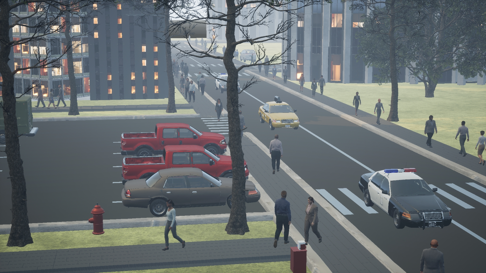    |  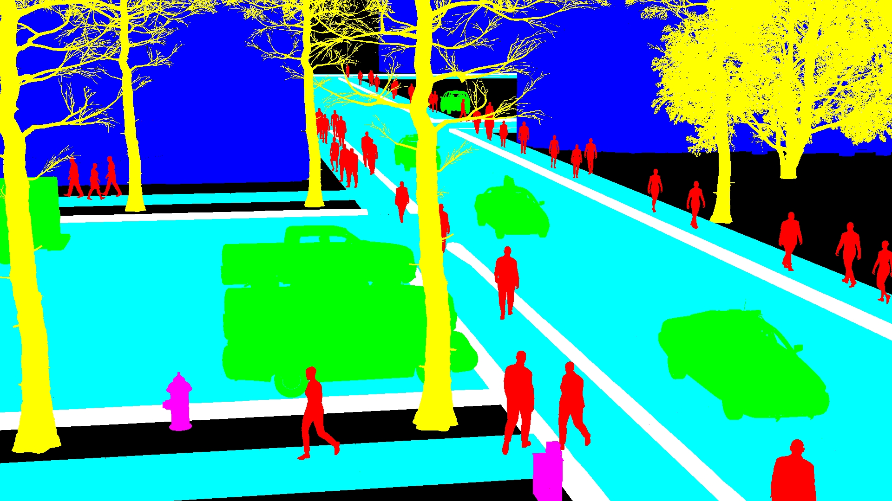
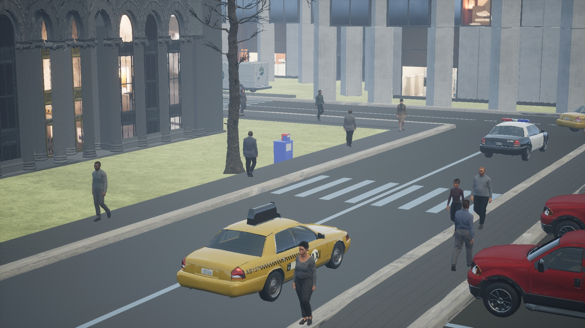    |  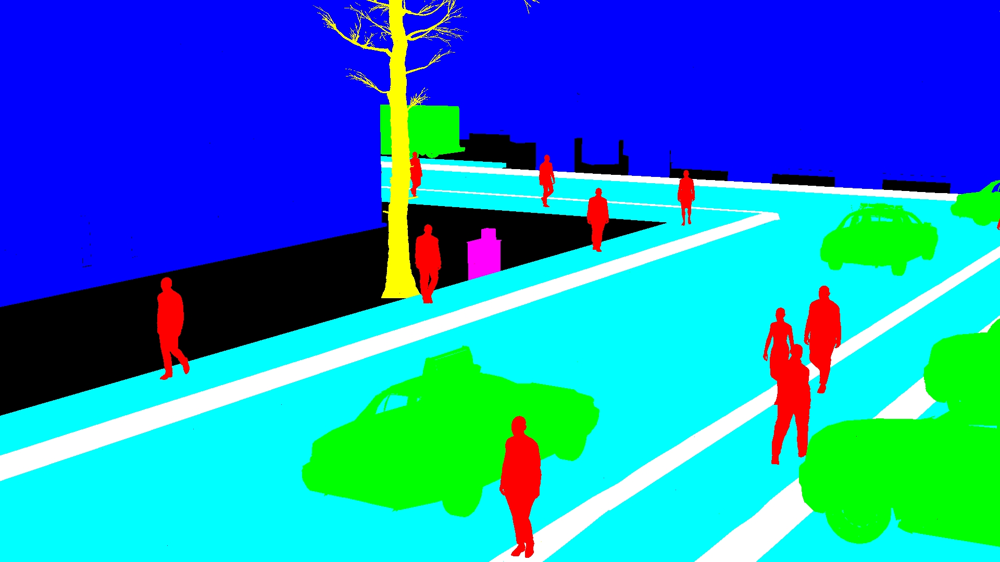
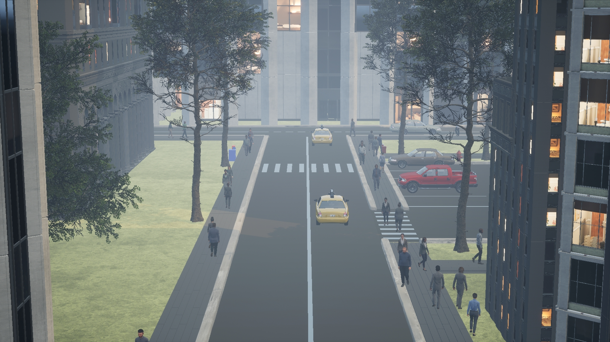    |  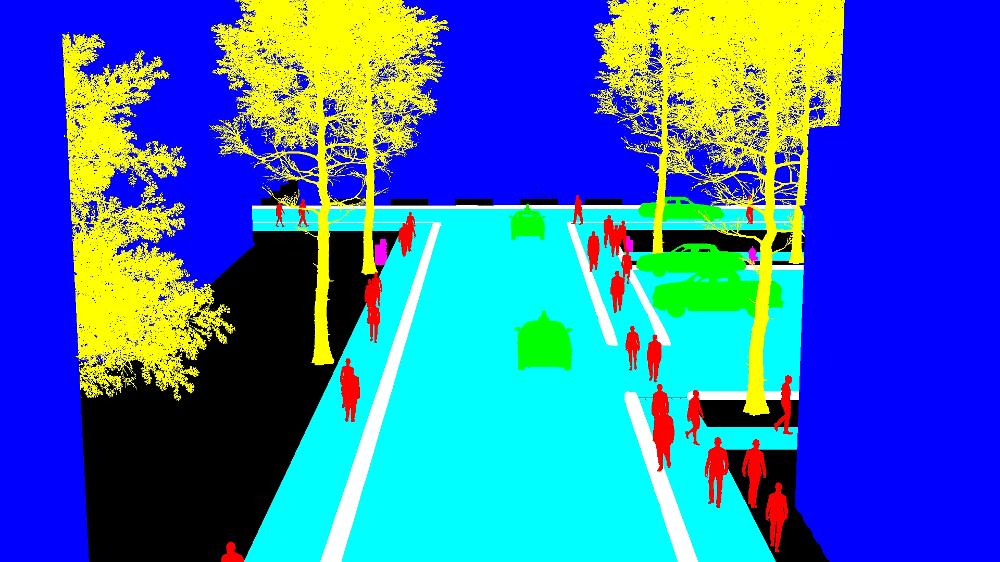
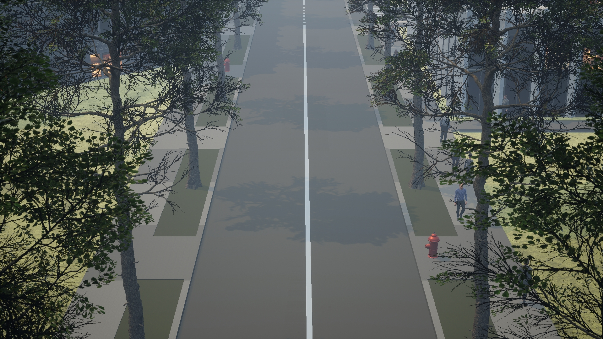    |  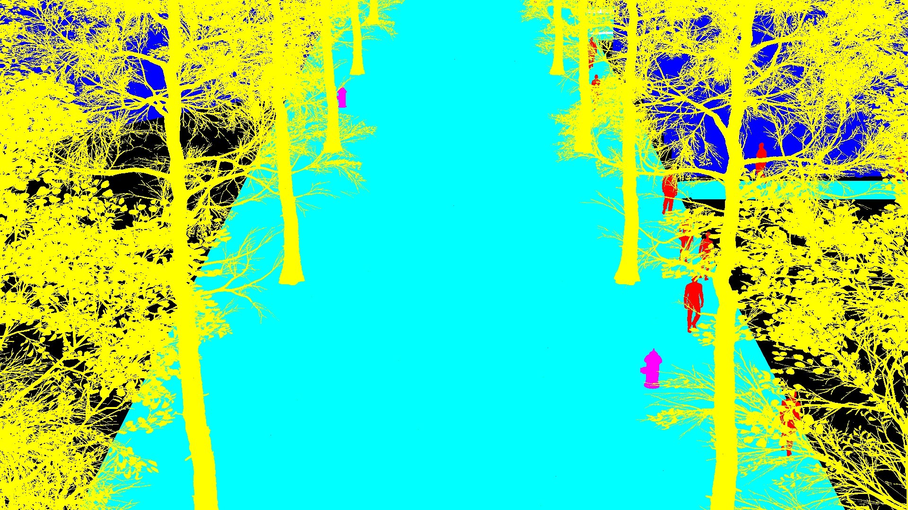

# Views of virtual city
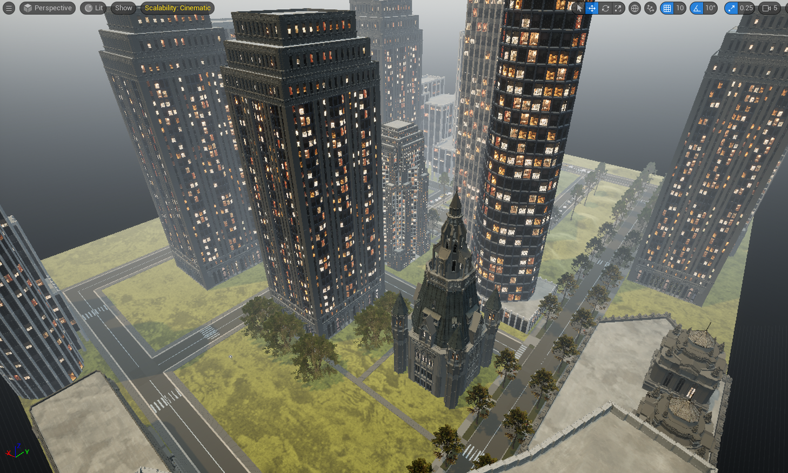 
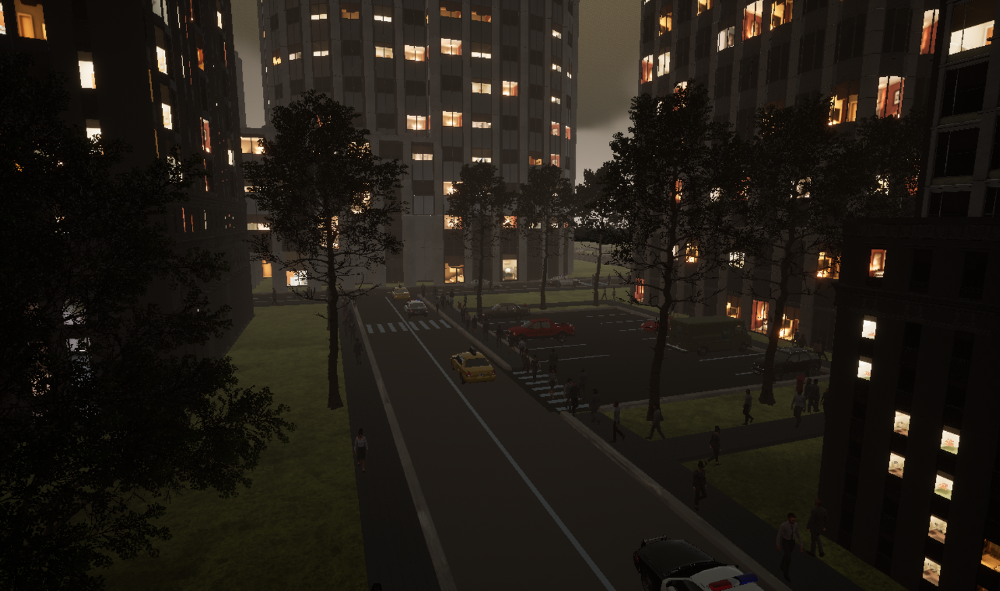 
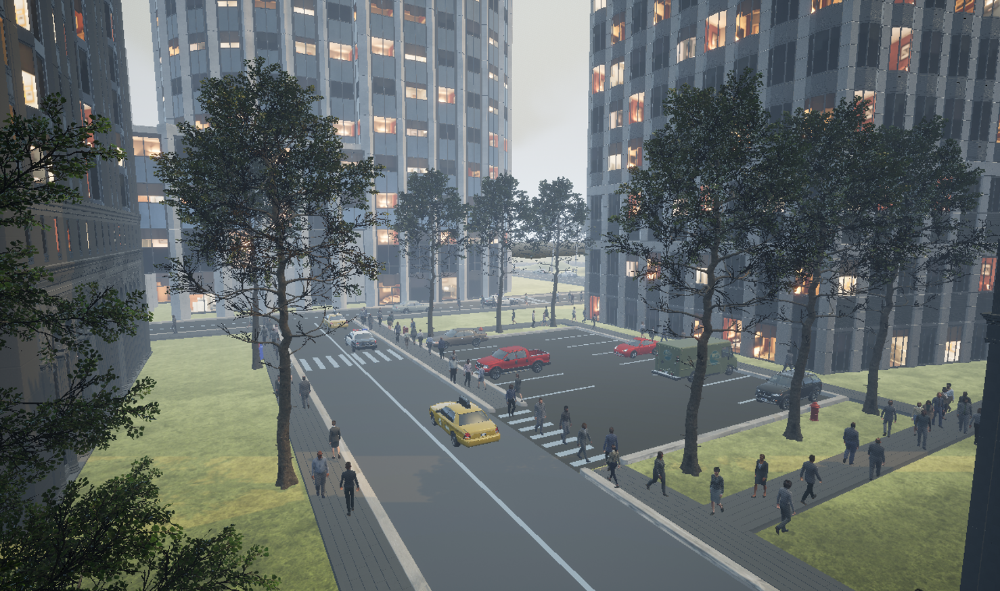 
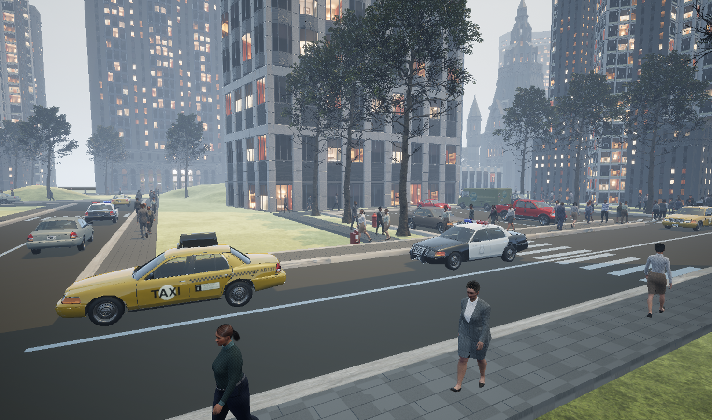 

# Window application with user interface
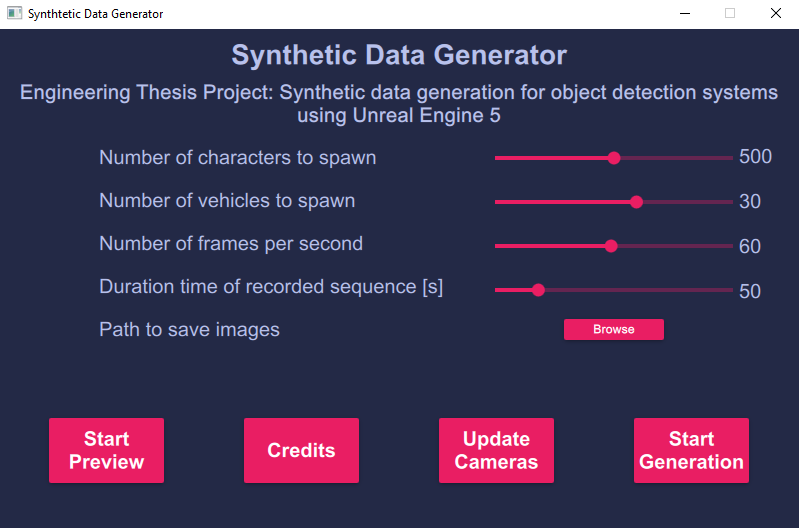 

# Demonstration video
[Demo video on Youtube](https://youtu.be/7gIBxZXtjus)

# Repository link
Due to large size of Unreal Engine project, repository was hosted on [Microsoft Azure DevOps](https://dev.azure.com/CitySimulation/City_Simulation).

# Authors:
- Hubert Furmann
- Jakub Grzesiak

